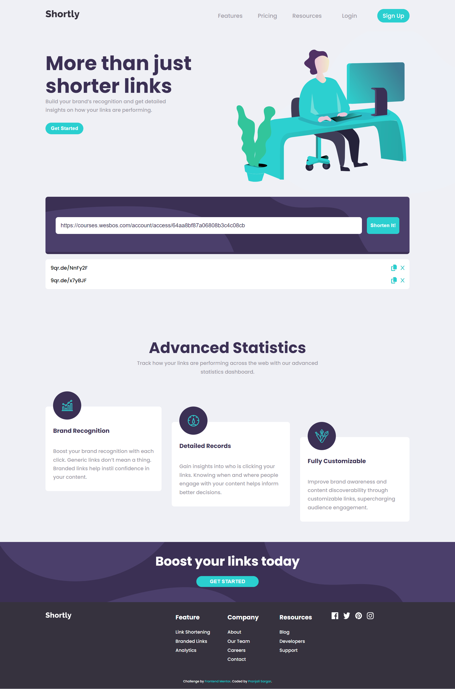

# Frontend Mentor - Shortly URL shortening API Challenge solution

This is a solution to the [Shortly URL shortening API Challenge challenge on Frontend Mentor](https://www.frontendmentor.io/challenges/url-shortening-api-landing-page-2ce3ob-G). Frontend Mentor challenges help you improve your coding skills by building realistic projects.

## Table of contents

- [Overview](#overview)
  - [The challenge](#the-challenge)
  - [Screenshot](#screenshot)
  - [Links](#links)
- [My process](#my-process)
  - [Built with](#built-with)
  - [What I learned](#what-i-learned)
  - [Continued development](#continued-development)
- [Author](#author)

## Overview

The goal of this landing page challenge is integration with the shortcode URL shortening API and playing with browser storage. The challenge is to integrate with the shrtcode API to create shortened URLs and display them like in the designs.

### The challenge

Users should be able to:

- View the optimal layout for the site depending on their device's screen size
- Shorten any valid URL
- See a list of their shortened links, even after refreshing the browser
- Copy the shortened link to their clipboard in a single click
- Receive an error message when the `form` is submitted if:
  - The `input` field is empty

### Screenshot

### Links

- Solution URL: [solution URL](https://your-solution-url.com)
- Live Site URL: [live site URL](https://your-live-site-url.com)

### Built with

- Semantic HTML5 markup
- CSS custom properties
- Flexbox
- CSS Grid
- Mobile-first workflow
- media queries
- [Styled Components](https://styled-components.com/) - For styles

### What I learned

Another attempt to play around with API and understand it better. Not very hard as I only need one data from get request. This will be my 5rd small project using API. Working with it is not difficult however it does get a little harder when I have to work with dynamic DOM elements. Once again was glad to practice some CSS and eventlisteners. I try not to match the original design as much as I did before as it takes more time and I prefer to spend it mostly on JavaScript.

The hardest part which I was not able to finish is saving the cache after reloading, clearing and deleting the generated URl. I tried different ways but I am not getting the final result. I do manage to retrieve the previous data (the input value, for instance) however I am unable to make it visible. I usually use console.log-s to understand what I am doing and it does work, I do retrieve everything I need but I have a hard time displaying it on dynamic elements. The elements stay there after refresh however they are empty. I will for sure get back to this project again!

## Author

- Frontend Mentor - [@Psargar616](https://www.frontendmentor.io/profile/Psargar616)
